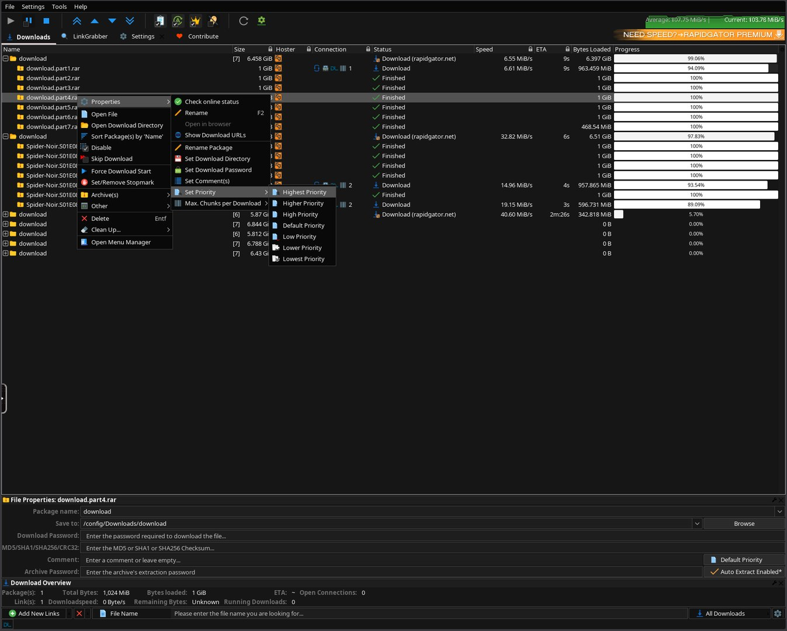
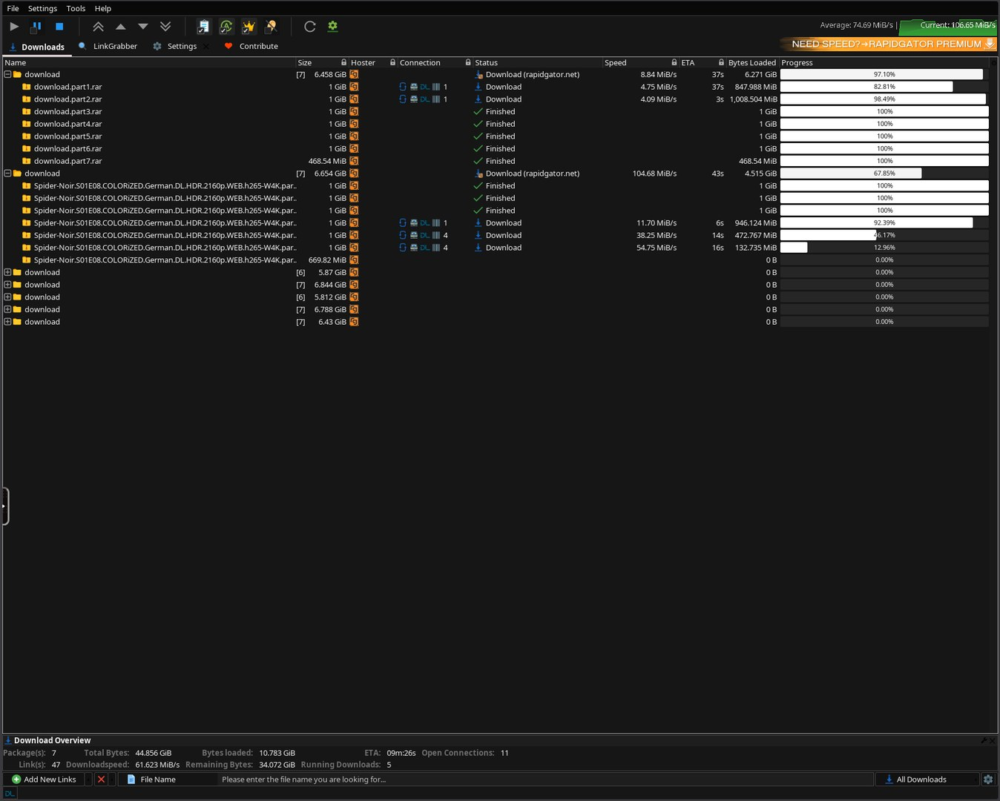
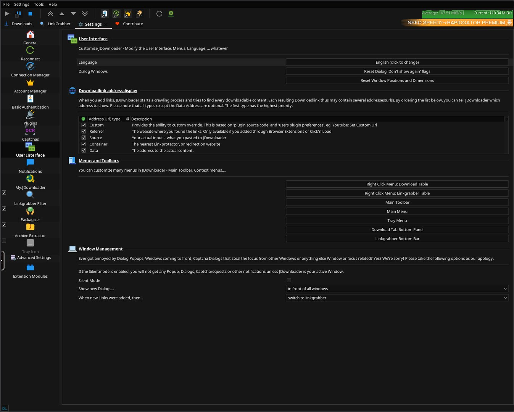

<a href="https://jdownloader.org">
  
</a>

<p align="center">
  <a href="https://github.com/junkerderprovinz/jdownloader/actions/workflows/build.yml"></a>&nbsp;
  <a href="https://github.com/junkerderprovinz/jdownloader/actions/workflows/lint.yml"></a>&nbsp;
  <a href="https://hub.docker.com/r/junkerderprovinz/jdownloader"></a>&nbsp;
  <a href="https://hub.docker.com/r/junkerderprovinz/jdownloader"></a>&nbsp;
  <a href="https://github.com/junkerderprovinz/jdownloader/pkgs/container/jdownloader"></a>&nbsp;
  <a href="https://github.com/kasmtech/KasmVNC"></a>&nbsp;
  <a href="https://unraid.net"></a>&nbsp;
  <a href="LICENSE"></a>
</p>

<br>

<p align="center">
A modern, plug-and-play Docker image for <b>JDownloader 2</b> on Unraid with a
<b>clean, sleek, fully dark and ad-free UI</b> out of the box — a monochrome IBM&nbsp;Carbon&nbsp;<code>#161616</code>
dark across the <i>entire</i> interface (download list, link grabber <b>and</b> settings, not just
the menu bar), with light fills + readable text on the progress bars and a borderless,
maximised kiosk window. JDownloader's built-in advertisements are switched off, so the
download graph keeps its full height. Full GUI in your browser via KasmVNC, zero first-run setup.
</p>

<br>

<p align="center">
  <a href="https://buymeacoffee.com/junkerderprovinz">
    
  </a>
</p>

<br>

## Table of Contents

1. [Overview](#1-overview)
2. [Screenshots](#2-screenshots)
3. [Quick Start](#3-quick-start)
4. [Configuration](#4-configuration)
5. [Customisation & Persistence](#5-customisation--persistence)
6. [Troubleshooting](#6-troubleshooting)
7. [Architecture](#7-architecture)
8. [Contributing / License](#8-contributing--license)
9. [Support this project](#9-support-this-project)
<br>

## 1. Overview

This image packages [JDownloader 2](https://jdownloader.org) into a self-contained Docker container that runs in any modern web browser. It is built on top of [`linuxserver/baseimage-kasmvnc`](https://github.com/linuxserver/docker-baseimage-kasmvnc), so it benefits from LSIO's hardware-accelerated KasmVNC stack and weekly security updates, while everything JDownloader-specific (dark theme, **ad-free defaults**, Java runtime, auto-install) is layered on top.

What's included beyond bare JDownloader:

- **KasmVNC** instead of noVNC — hardware-accelerated rendering, real browser clipboard, native file upload and download, high-DPI ready
- **Sleek, complete Dark Mode** pre-applied — a monochrome IBM Carbon (#161616) dark across the *entire* GUI (download list, link grabber **and** settings, not just the menu bar), in a clean maximised kiosk window; switch to a matching Light theme with one variable
- **Ad-free by default** — JDownloader's built-in advertisements (the *"Become premium user"* banner, the premium-alert column nags, the special-deal popups) are switched off, so the GUI stays clean and the download speed graph keeps its **full height**
- **Java 21 JRE** — full AWT/Swing support for the JDownloader GUI, not headless
- **Auto-install** — downloads and installs JDownloader 2 on first container start, no manual JAR setup
- **Self-updating** — JDownloader updates itself on every start as it normally does
- **Update-safe config** — all settings, links and session state live in `/config` and survive every `docker pull`
- **Multi-arch** — amd64 and arm64

| | **This image** | jlesage | jaymoulin |
|---|:---:|:---:|:---:|
| Web stack | **KasmVNC** | noVNC | — (headless) |
| HW-accelerated rendering | ✅ | ❌ | ❌ |
| Browser clipboard | ✅ | ⚠️ | ❌ |
| File upload via WebUI | ✅ | ❌ | ❌ |
| Full dark UI (content too) | ✅ | ❌ | ❌ |
| Ad-free by default | ✅ | ❌ | ❌ |
| Auto-install on first start | ✅ | ✅ | ✅ |
| Multi-arch | ✅ amd64 + arm64 | ✅ | ✅ |
| Base | LinuxServer/KasmVNC | jlesage/Alpine | Alpine |

<br>

## 2. Screenshots

<p align="center">
  
  <br><em>Download list in monochrome Carbon <code>#161616</code> — right-click menu, per-file priority, live speed/ETA.</em>
</p>

<br>

<p align="center">
  
  <br><em>Multiple packages downloading — uniform dark rows, light progress bars, green speed graph.</em>
</p>

<br>

<p align="center">
  
  <br><em>Settings &rarr; User Interface — fully dark, the same Carbon palette across the whole app.</em>
</p>

<br>

## 3. Quick Start

### Step 1 — Install the template

In Unraid: **Apps** → search for **JDownloader** → click **Install**.

The Community Applications template is published from the
[`unraid-apps`](https://github.com/junkerderprovinz/unraid-apps) feed
(one feed for all of junkerderprovinz's apps). If the Template dropdown in **Docker → Add
Container** no longer accepts a URL on your Unraid version, drop the XML directly into the
templates-user folder via SSH (or WinSCP). **Important:** the filename must be
`my-JDownloader.xml` with the `my-` prefix and capital `J` — otherwise Unraid sees it as a
separate template and a `Force Update` will reset all customizations.

```bash
wget -O /boot/config/plugins/dockerMan/templates-user/my-JDownloader.xml \
    https://raw.githubusercontent.com/junkerderprovinz/unraid-apps/main/jdownloader/jdownloader.xml
```

### Step 2 — Adjust paths and start

The defaults work out of the box, but you may want to tweak:

- **Config (`/config`)** — defaults to `/mnt/user/appdata/jdownloader`
- **Downloads (`/downloads`)** — defaults to `/mnt/user/downloads`; this is where JDownloader saves files
- **Theme** — default `Dark` (JD Plain Dark, Carbon #161616 palette); switch to `Light` any time
- **KasmVNC Password** — leave empty for LAN-only, set anything for exposure beyond the LAN

Click **Apply**.

> ## ⏳ First start — wait for the READY banner
>
> On the **first start (and after every image update)** JDownloader installs/updates itself
> and applies the dark theme. **The WebUI stays black for a few minutes.** Open the container
> **log** and wait for this banner *before* you open the WebUI:
>
> ```text
> ############################################################
>  JDOWNLOADER IS READY  ->  open the WebUI now (HTTPS 3001)
> ############################################################
> ```
>
> **Do not restart the container while it installs.** The banner is shown only once the GUI is
> up **and** the dark theme is fully applied — so when you see it, the UI is already dark and
> ready. (It self-heals JDownloader's first-run theme reset, then prints the banner.)

### Step 3 — Open the WebUI

Use **`https://<unraid-ip>:3001/`** (this is what the template's WebUI button opens). HTTPS is needed for **seamless clipboard** — copy on your PC and paste straight into JD; accept the self-signed cert warning once. Plain `http://<unraid-ip>:3000/` also works, but browsers block its clipboard (you'd use KasmVNC's clipboard panel).

The JDownloader GUI appears automatically once the install completes.

<details>
<summary>docker-compose (non-Unraid)</summary>

```yaml
services:
  jdownloader:
    image: junkerderprovinz/jdownloader:latest
    container_name: jdownloader
    environment:
      - PUID=99
      - PGID=100
      - TZ=Europe/Vienna
      - JD_THEME=Dark
    volumes:
      - /mnt/user/appdata/jdownloader:/config
      - /mnt/user/downloads:/downloads
    ports:
      - 3000:3000
      - 3001:3001
    restart: unless-stopped
    shm_size: 1gb
```

**`shm_size: 1gb`** is required for smooth KasmVNC rendering.

</details>

<br>

## 4. Configuration

| Variable | Default | Description |
|---|---|---|
| `JD_THEME` | `Dark` | UI theme — `Dark` = monochrome Carbon `#161616`, `Light` = JD's light theme |
| `PUID` | `99` | User ID — Unraid's *nobody* |
| `PGID` | `100` | Group ID — Unraid's *users* |
| `TZ` | `Europe/Vienna` | Timezone |
| `CUSTOM_USER` | _(empty)_ | KasmVNC username — leave empty for no auth |
| `PASSWORD` | _(empty)_ | KasmVNC password — **set this if exposed beyond LAN** |
| `UMASK` | `022` | File-creation mask |

| Port | Purpose | | Volume | Purpose |
|---|---|---|---|---|
| `3000` | KasmVNC HTTP | | `/config` | Persistent JDownloader config, links, session |
| `3001` | KasmVNC HTTPS *(self-signed)* | | `/downloads` | Download destination |

> **Language:** the UI is **English** by default. Change it any time in JDownloader's own language menu (top toolbar → the flag icon, or *Settings → Language*) — your choice is saved and persists across restarts.

<br>

## 5. Customisation & Persistence

On the **first start**, JDownloader installs itself into `/config/JDownloader/`. All settings, link lists, accounts and download history live there and survive every `docker pull` and container update.

```
/config/
└── JDownloader/
    ├── cfg/
    │   └── laf/      # the Carbon #161616 colorfor* palette (re-applied every start)
    ├── libs/laf/     # FlatLaf — flatlaf.jar is patched to the #161616 dark every start
    ├── themes/flat/  # bundled flat icon set (re-seeded from the image every start)
    └── JDownloader.jar
```

The env-driven setting `JD_THEME` is re-applied on **every start**, so you can change it at any time via the Unraid template.

The base image also supports `/config/custom-cont-init.d/` for your own init scripts — see the [LinuxServer docs](https://docs.linuxserver.io/general/container-customization/).

<br>

## 6. Troubleshooting

<details>
<summary><b>WebUI is black / desktop never appears</b></summary>

- Make sure `shm_size` is at least `512mb` (Unraid template sets `1gb`)
- Check the container log for KasmVNC startup errors
- Try `https://<ip>:3001/` — sometimes browsers block WebSockets over plain HTTP
- **First start takes a few minutes** — JDownloader installs itself + its dark theme; the screen stays black until done. Watch the container log for the **`JDOWNLOADER IS READY`** banner, then refresh. Don't restart the container.
- **First start only:** JDownloader may ask once to install its design + a few extensions — click **OK** / **Install now**. Afterwards it stays dark with no prompts.
</details>

<details>
<summary><b>Can't paste into JD / clipboard only works via the KasmVNC panel</b></summary>

- Open the WebUI over **HTTPS** (`https://<ip>:3001/` — the template's WebUI button). Browsers only allow the seamless clipboard API in a **secure context**; over plain HTTP it's blocked, so you'd have to use KasmVNC's clipboard panel.
- If prompted, allow the browser's clipboard permission (lock icon → site settings).
</details>

<details>
<summary><b>JDownloader GUI doesn't appear after 2 minutes</b></summary>

- Open the container log and look for `init-jdownloader` messages
- If you see `JDownloader2.jar missing after installer run` — the installer needs an internet connection on first start. Ensure the container has internet access.
- Restart the container once — the installer retries automatically
</details>

<details>
<summary><b>Dark mode not active</b></summary>

- Verify `JD_THEME=Dark` is set in your template
- Check the container log for `[jdownloader-theme]` lines
- The theme is applied at container start, not live — restart after changing `JD_THEME`
</details>

<details>
<summary><b>"Permission denied" on /downloads</b></summary>

- Check `PUID` / `PGID`. On Unraid, `99:100` (nobody:users) matches share permissions.
- Verify your `/downloads` share has the right permissions: **Docker** → **Edit** → check the path
</details>

<details>
<summary><b>KasmVNC password not accepted</b></summary>

- Open in a private/incognito window once — your browser may have cached old credentials
</details>

<br>

## 7. Architecture

```
ghcr.io/linuxserver/baseimage-kasmvnc   (s6-overlay v3 · KasmVNC · weekly LSIO updates)
      │
      ▼  cont-init.d/10-jdownloader-setup        (runs once, before the desktop starts)
      │     • writes JD's native Carbon #161616 colorfor* palette   → cfg/laf
      │     • seeds the bundled flat icon set                       → themes/flat
      │     • patches flatlaf.jar to the #161616 dark chrome        → libs/laf
      │     • language · tray off · openbox kiosk (no title bar, dialogs not maximised)
      ▼
   svc-de  →  /defaults/autostart   (the JDownloader launcher loop)
      │     • java -jar JDownloader.jar     (installs JD 2 on first run)
      │     • re-applies the colorfor*/icons/flatlaf theme before each launch
      │     • theme auto-heal: restarts JD once if its self-update reset the theme
      │     • a -javaagent auto-confirms JD's forced install dialogs
      │     • prints "JDOWNLOADER IS READY" only when JD is up AND dark
      ▼
   JDownloader 2   (Java Swing GUI, streamed to your browser by KasmVNC)
      ▲
   svc-de/finish  →  SIGTERMs the JVM on stop so it flushes column layout / settings
```

<br>

## 8. Contributing / License

Pull requests welcome. Issues: <https://github.com/junkerderprovinz/jdownloader/issues>.

**Licensing — dual:**

- This **wrapper repository** (Dockerfile, `rootfs/`, scripts, Unraid template, README and banner/icon artwork) is licensed under the [MIT License](LICENSE).
- **JDownloader 2** itself retains its own license (see [jdownloader.org/license](https://jdownloader.org/license)). When you run or redistribute the resulting container image, you must comply with JDownloader's license as well.

```bash
# Run lints locally (same as CI)
docker run --rm -i hadolint/hadolint < Dockerfile
find rootfs -name '*.sh' | xargs shellcheck --severity=warning --shell=bash
find . -name '*.xml' | xargs xmllint --noout
```

### Credits

- [**JDownloader 2**](https://jdownloader.org) — AppWork GmbH & the JDownloader team
- [**LinuxServer.io**](https://www.linuxserver.io) — for the excellent [`baseimage-kasmvnc`](https://github.com/linuxserver/docker-baseimage-kasmvnc)
- [**KasmVNC**](https://github.com/kasmtech/KasmVNC) — for remote desktop in a browser that actually works
- [**Icons8**](https://icons8.com) — the bundled "JD Plain" flat icon set uses JDownloader's Icons8 icons, redistributed verbatim under [CC BY-ND 3.0](https://icons8.com/license)
- Inspiration: jlesage and jaymoulin JDownloader containers — they paved the way

<br>

## 9. Support this project

If this image saves you time or a debug night, consider buying me a coffee:

<p align="center">
  <a href="https://buymeacoffee.com/junkerderprovinz">
    
  </a>
</p>
