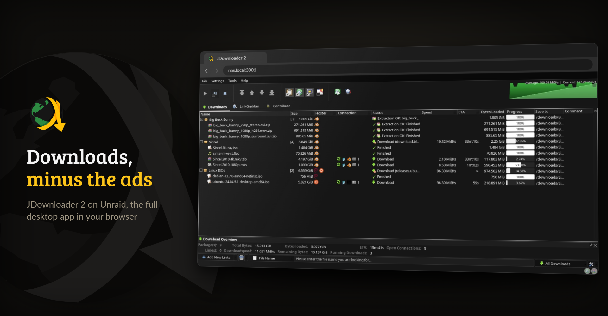
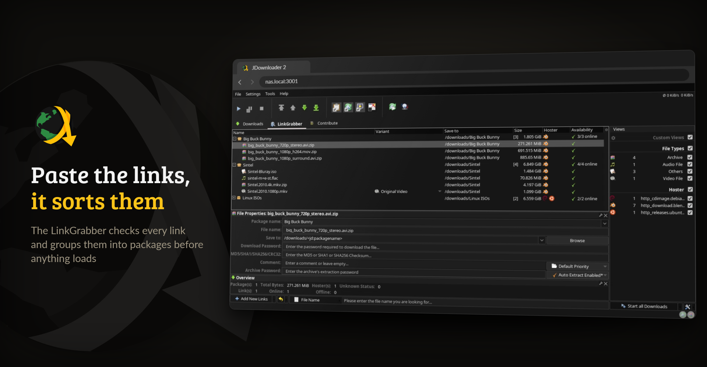
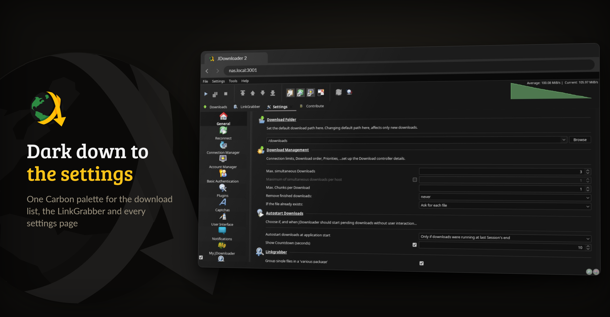

<p align="center">
  <picture>
    <source media="(prefers-color-scheme: dark)" srcset="https://raw.githubusercontent.com/junkerderprovinz/jdownloader/main/.github/assets/jdownloader-banner-dark.png">
    
  </picture>
</p>

<p align="center">
  <a href="https://github.com/junkerderprovinz/jdownloader/actions/workflows/build.yml"></a>&nbsp;
  <a href="https://github.com/junkerderprovinz/jdownloader/actions/workflows/lint.yml"></a>&nbsp;
  <a href="https://hub.docker.com/r/junkerderprovinz/jdownloader"></a>&nbsp;
  <a href="https://hub.docker.com/r/junkerderprovinz/jdownloader"></a>&nbsp;
  <a href="https://github.com/junkerderprovinz/jdownloader/pkgs/container/jdownloader"></a>&nbsp;
  <a href="https://github.com/selkies-project/selkies"></a>&nbsp;
  <a href="https://unraid.net"></a>&nbsp;
  <a href="LICENSE"></a>
</p>

<br>

<p align="center">
A modern, plug-and-play Docker image for <b>JDownloader 2</b> on Unraid with a
<b>fully dark and ad-free UI</b> out of the box: a monochrome IBM&nbsp;Carbon&nbsp;<code>#161616</code>
dark across the <i>entire</i> interface (download list, link grabber <b>and</b> settings, not just
the menu bar), with light fills + readable text on the progress bars and a borderless,
maximised kiosk window. JDownloader's built-in advertisements are switched off, so the
download graph keeps its full height. Full GUI in your browser via Selkies, zero first-run setup.
</p>

<!-- download-buttons: written by scripts/gen_download_buttons.py -->
<p align="center">
  <a href="https://ca.unraid.net/apps/jdownloader-18m0vwh17mexzh"></a>
  &nbsp;
  <a href="https://hub.docker.com/r/junkerderprovinz/jdownloader/"></a>
  &nbsp;
  <a href="https://github.com/junkerderprovinz/jdownloader/releases/latest"></a>
</p>
<!-- /download-buttons -->

<br>

<p align="center">
A one-knight job: I build it, keep it running, work through the issues and add what people ask for, until nothing is missing. It is free, with no accounts, no telemetry, no ads and no paid tier. No asterisk anywhere. Nothing readable ever leaves your own walls. Forged on evenings and weekends, with heart and stubbornness.
</p>

<p align="center">
If it has earned a place on your server or computer, toss a coin to your knight: it helps cover the costs and keeps the project alive. It also makes this knight's heart beat a little faster. Three ways below, whichever suits you.
</p>

<!-- give-buttons: written by scripts/gen_download_buttons.py -->
<p align="center">
  <a href="https://buymeacoffee.com/junkerderprovinz"></a>
  &nbsp;
  <a href="https://www.paypal.com/donate/?hosted_button_id=76FVV52TKXTUS"></a>
  &nbsp;
  <a href="https://junkerderprovinz.github.io/junkerderprovinz/"></a>
</p>
<!-- /give-buttons -->

<br>

## Table of Contents

1. [What it looks like](#1-what-it-looks-like)
2. [What it does](#2-what-it-does)
3. [How it compares](#3-how-it-compares)
4. [Getting started](#4-getting-started)
5. [How AI is used here](#5-how-ai-is-used-here)
6. [Support this project](#6-support-this-project)

<br>

## 1. What it looks like

The downloads in these pictures are Blender's open movies and two Linux images, loaded in a test container.

<p align="center">
  
  <br><em>The download list in Dark Mode, with the speed graph at full height</em>
</p>

<p align="center">
  
  <br><em>The LinkGrabber checks each link and sorts it into a package before you start</em>
</p>

<p align="center">
  
  <br><em>The settings use the same dark palette as everything else</em>
</p>

<br>

## 2. What it does

- **Selkies instead of noVNC.** A hybrid VNC and H.264 stream for a smooth desktop at 60 fps, a real clipboard in both directions, and file upload and download from the browser.
- **Dark everywhere.** A monochrome IBM Carbon `#161616` palette covers the download list, the LinkGrabber and the settings, not only the menu bar. One variable switches to a matching light theme or to JDownloader's classic look.
- **No ads.** The premium banner, the nag columns and the deal popups are switched off, so the speed graph keeps its full height.
- **Nothing to set up.** JDownloader installs itself on the first start and updates itself as usual, with Java 21 for the full Swing GUI.
- **Your settings survive updates.** Links, accounts and session state live in `/config`, and the image runs on amd64 and arm64.

<br>

## 3. How it compares

| | **This image** | jlesage | jaymoulin |
|---|:---:|:---:|:---:|
| Web stack | **Selkies** | noVNC | n/a (headless) |
| HW-accelerated rendering | ✅ | ❌ | ❌ |
| Browser clipboard | ✅ | ⚠️ | ❌ |
| File upload via WebUI | ✅ | ❌ | ❌ |
| Full dark UI (content too) | ✅ | ❌ | ❌ |
| Ad-free by default | ✅ | ❌ | ❌ |
| Auto-install on first start | ✅ | ✅ | ✅ |
| Multi-arch | ✅ amd64 + arm64 | ✅ | ✅ |
| Base | LinuxServer/Selkies | jlesage/Alpine | Alpine |

<br>

## 4. Getting started

On Unraid, install JDownloader from [Community Applications](https://ca.unraid.net/apps/jdownloader-18m0vwh17mexzh). The defaults work as they are: `/config` goes to `/mnt/user/appdata/jdownloader` and downloads to `/mnt/user/downloads`. Set a WebUI password if the server can be reached from outside your network.

> [!IMPORTANT]
> On the first start, and after every image update, JDownloader installs or updates itself and the WebUI stays black for a few minutes. Wait for `JDOWNLOADER IS READY` in the container log before you open it, and do not restart the container in the meantime.

Then open `https://<server-ip>:3001/` and accept the self-signed certificate once. The Selkies client needs HTTPS for its video decoder and for the clipboard. Port `3000` is plain HTTP and only works behind a reverse proxy that handles TLS.

Without Unraid:

```bash
docker run -d --name jdownloader --shm-size=1gb \
  -p 3001:3001 \
  -e PUID=99 -e PGID=100 \
  -v /path/to/appdata/jdownloader:/config \
  -v /path/to/downloads:/downloads \
  junkerderprovinz/jdownloader:latest
```

`--shm-size=1gb` keeps Selkies rendering smooth; the Unraid template sets it for you. The interface starts in English, and JDownloader's own settings switch the language.

<br>

## 5. How AI is used here

One knight builds this, and AI is one of the tools I work with, the same way I work with an editor or a compiler. It helps me write code and documentation and it checks my work, and that saves me a good many evenings. It does not make the decisions, though. I read and understand everything before it ships, and if something here breaks, that is on me and not on the tool.

You do not have to take my word for it. The code is open and every release note is written by hand. The issue tracker shows how problems actually get handled, including the ones I got wrong the first time. If you find something that is not right, open an issue and I will look at it.

<br>

## 6. Support this project

Questions? Check the [support thread](https://forums.unraid.net/topic/199305-support-junkerderprovinz-jdownloader-2/). Bugs, ideas or feature requests? Please [open a GitHub issue](https://github.com/junkerderprovinz/jdownloader/issues).

A one-knight job: I build it, keep it running, work through the issues and add what people ask for, until nothing is missing. It is free, with no accounts, no telemetry, no ads and no paid tier. No asterisk anywhere. Nothing readable ever leaves your own walls. Forged on evenings and weekends, with heart and stubbornness.

If it has earned a place on your server or computer, toss a coin to your knight: it helps cover the costs and keeps the project alive. It also makes this knight's heart beat a little faster. Three ways below, whichever suits you.

<!-- give-buttons: written by scripts/gen_download_buttons.py -->
<p align="center">
  <a href="https://buymeacoffee.com/junkerderprovinz"></a>
  &nbsp;
  <a href="https://www.paypal.com/donate/?hosted_button_id=76FVV52TKXTUS"></a>
  &nbsp;
  <a href="https://junkerderprovinz.github.io/junkerderprovinz/"></a>
</p>
<!-- /give-buttons -->

<br>

<sub>The packaging in this repository is AGPL-3.0. JDownloader 2 keeps its own <a href="https://jdownloader.org/license">licence</a>, and the bundled icon set is JDownloader's Icons8 icons under <a href="https://icons8.com/license">CC BY-ND 3.0</a>; see <a href="LICENSE">LICENSE</a>.</sub>
